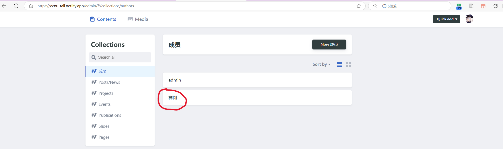
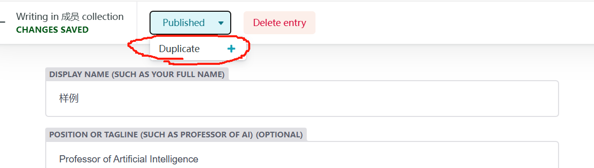
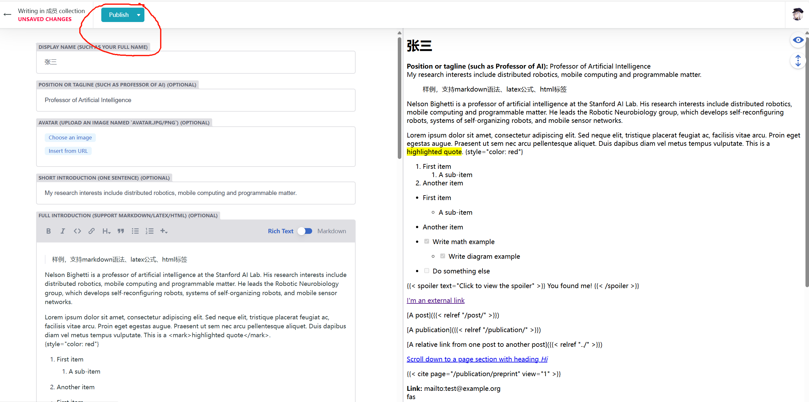

# 可信AI实验室
- 网址1：[https://ippqw5.github.io/TAIL/](https://ippqw5.github.io/TAIL/) github pages部署
- 网址2：[https://ecnu-tail.netlify.app/](https://ecnu-tail.netlify.app/) netlify部署

都是基于这个仓库的内容进行部署的。

## 添加/修改 信息

> 以添加/修改 `个人信息 ` 为例

### 方法1：
1. 克隆仓库到本地
2. 在`content/authors/`目录下复制一份`样例`文件夹
3. 重命名文件夹为你的名字，例如`张三`
4. 根据`张三/_index.md`里的注释修改文件内容
5. 提交PR

### 方法2：
直接在网页端进行修改(使用netlify提供的后台管理系统)

1. 进入[https://ecnu-tail.netlify.app/admin/](https://ecnu-tail.netlify.app/admin/)，选择`样例`

2. 进入表单页面，选择`duplicate`复制一份后，开始修改表单内容

3. 填写完成后，选择`Publish`发布即可

