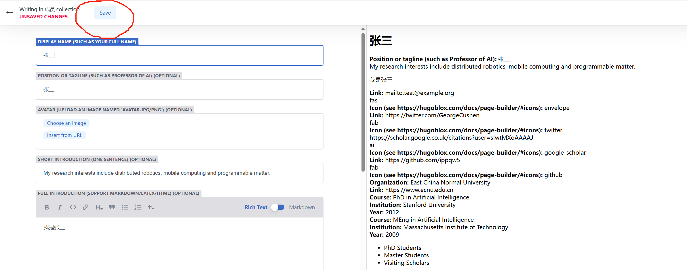

# 可信AI实验室

- 网址1：[https://ippqw5.github.io/TAIL/](https://ippqw5.github.io/TAIL/)

## 添加信息

> 以添加 `个人主页 ` 为例
1. [登录后台管理系统](https://ecnu-tail.netlify.app/admin/)，注册一个账号 或者 使用github登录。
    
2. 选择 `样例`
   
3. 进入表单页面，选择 `duplicate`复制一份后，开始修改表单内容
   
4. 填写完成后，选择 `save`即可。系统会自动提交PR，等待管理员合并
   
5. `save`之后显示如下界面，**不要点 `Publish` !!!**
   
